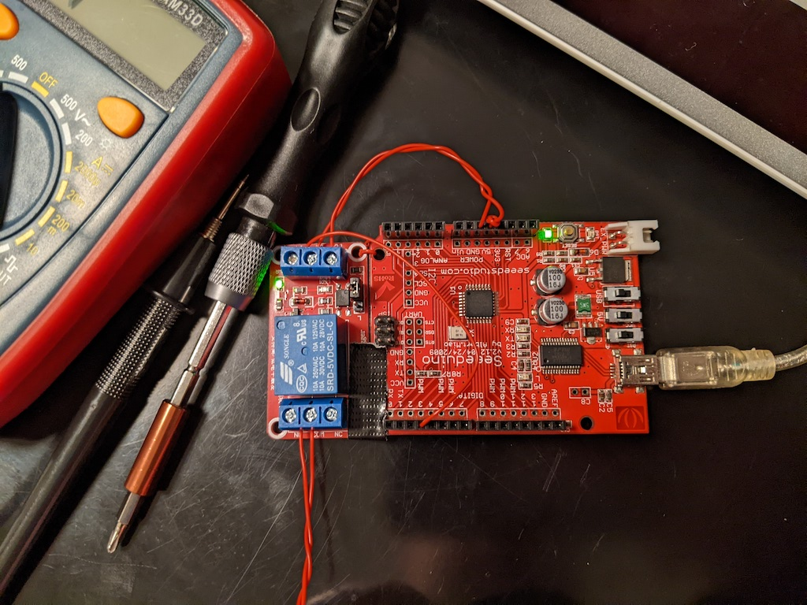
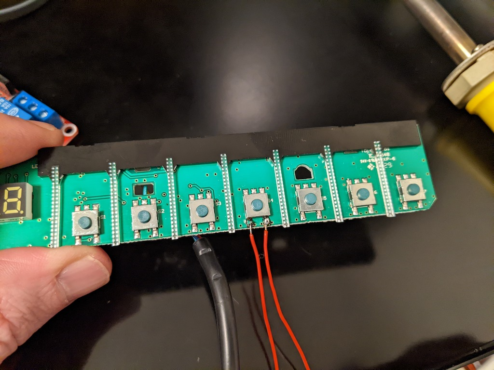
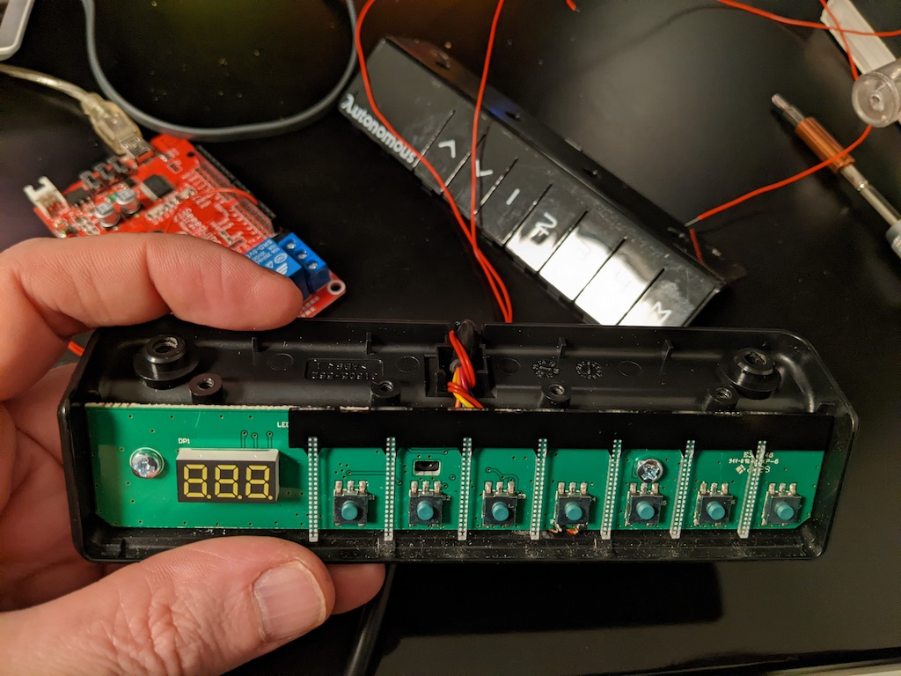

# autonomous_stand

Automatically raise a motorized standing desk on a schedule (if the laptop is docked and not sleeping). Because I keep forgetting I have a standing desk.

My colleague Harsh shared this post with me https://medium.com/@davidkongfilm/how-i-hacked-my-standing-desk-with-a-raspberry-pi-a50ed14c7f6f, which I adapted to use an old Arduino that I already had, and a different relay because I couldn't find the one mentioned for sale.

Relay: https://www.amazon.com/gp/product/B00LW15A4W - Costs $6 for a pair, works with Arduino, Raspberry Pi or any other 5V system and also supports high voltage (in case you find some other use for the second relay).

# Setup

Connect the Relay to the Arduino - GND, 5V and Input (pick any of the digital pins, make sure the code points to the same pin!):

# Upload the code to your Arduino

[autonomous_stand.ino](./autonomous_stand.ino)

# Soldering

Solder a couple wires to the button that you would usually press to raise the table; 

Test by shorting the 2 wires, then reinstall the panel:

Finally, connect the wires to the COMM and NO (normally open) ports on the relay. Doesn't matter which wire is on COMM or NO - the relay will just close the circuit when activated.

# All set on the hardware side!

# Testing end-to-end

1. Connect the arduino to your dock or laptop via USB

2. Execute [./send_cmd.sh](send_cmd.sh)

# Schedule to execute automatically

TODO