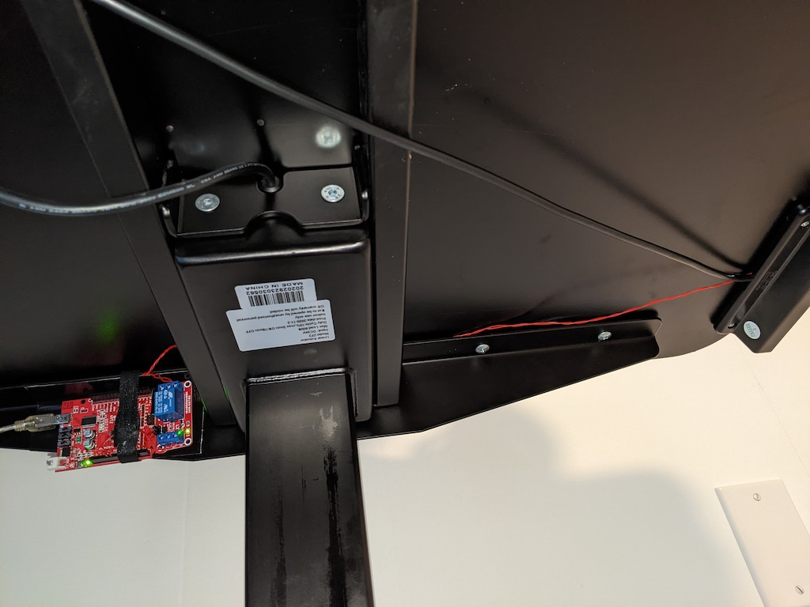

# autonomous_stand

Automatically raise a motorized standing desk on a schedule (if the laptop is docked, not sleeping and, optionally, not on Zoom video). Because I keep forgetting I have a standing desk.

I have the classic standing desk from https://www.autonomous.ai. Nowadays it looks like they also offer a model that has some scheduling support built in.

My colleague Harsh shared this post with me https://medium.com/@davidkongfilm/how-i-hacked-my-standing-desk-with-a-raspberry-pi-a50ed14c7f6f, which I adapted to use an old Arduino that I already had, and a different relay because I couldn't find the one mentioned for sale. Also by controlling the schedule on the laptop rather than on the Raspberry Pi/Arduino, we can avoid raising the table at inopportune times.

Relay: https://www.amazon.com/gp/product/B00LW15A4W - Costs $6 for a pair, works with Arduino, Raspberry Pi or any other 5V system and also supports high voltage (in case you find some other use for the second relay).

# Setup

Connect the Relay to the Arduino - GND to GND, 5V to 5V and Input to any of the digital pins - I'm using pin #3 (make sure the code points to the same pin):

# Upload the code to your Arduino

[src/arduino/autonomous_stand.ino](src/arduino/autonomous_stand.ino) (change `RELAY_PIN` if necessary)

# Soldering

Solder a couple wires to the button that you would usually press to raise the table (setting #2 in my case): 

Test by shorting the 2 wires, then reinstall the panel:

Finally, connect the wires to the COMM and NO (normally open) ports on the relay. Doesn't matter which wire is on COMM or NO - the relay will just close the circuit when activated.

# All set on the hardware side!

# Testing end-to-end

1. Connect the arduino to your dock or laptop via USB
2. Fix the device location in the [bin/send_cmd.sh](bin/send_cmd.sh) script.
2. Execute `bin/send_cmd.sh` on the terminal

# Schedule it to execute automatically

1. Execute `crontab -e` on the terminal

2. Add a line with the interval of your preference (check out https://crontab.guru): 
   
   `0 9-17 * * 1-5 </PATH_TO>/autonomous_stand/bin/run.sh`
   
3. MacOS-specific: To prevent raising the desk when Zoom Video is on, allow `crontab` in System Preferences > Accessibility > Permissions. Or set `CHECK_ZOOM_STATUS` to `false` in [bin/run.sh](bin/run.sh) to disable.
